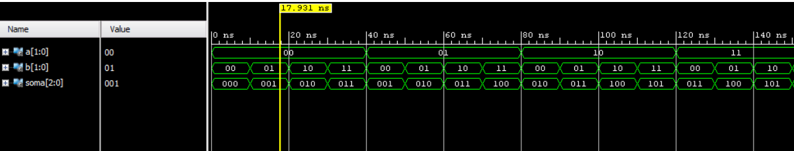
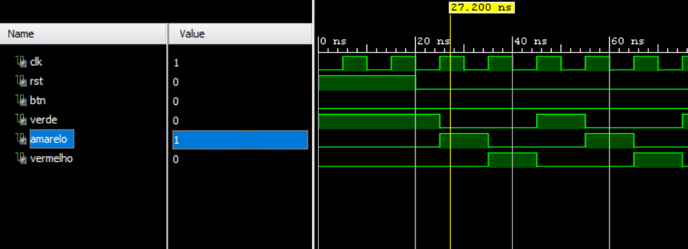

# Projetos em VHDL

Este repositório contém implementações de projetos em VHDL, com foco em Máquinas de Estados Finitos (FSMs) e circuitos digitais básicos. Cada projeto inclui código-fonte, TestBench e resultados de simulação para validação do comportamento esperado dos circuitos.

---

## 🔢 1. Somador de 2 Bits

O projeto implementa um **Somador de 2 bits**, onde a soma é feita utilizando operações aritméticas em vetores `STD_LOGIC_VECTOR`. O resultado é gerado em 3 bits para acomodar o carry.

**TestBench**: A verificação é realizada com todas as 16 combinações possíveis de entradas (`a` e `b`). O TestBench simula as entradas de `a` de "00" a "11" e de `b` também de "00" a "11", garantindo que cada possível soma seja validada contra o valor esperado.

---

## 🔍 2. Detector de Sequência (FSM 5 Bits)

Este projeto implementa uma **Máquina de Estados Finitos (FSM)** do tipo **Moore**, responsável por detectar a sequência de 5 bits `11010`. A saída `detect` é ativada quando essa sequência é detectada.

**TestBench**: O TestBench foi desenvolvido para validar a FSM em diferentes cenários, incluindo:

- ➡️ Sequências que **não ativam** a saída `detect`.
- ✅ A sequência correta **"11010"**, que ativa a saída `detect` para `'1'`.
- ❌ Sequências incorretas ou parciais, garantindo que a FSM retorne ao estado inicial corretamente, sem gerar falsos positivos.

---

## 🚦 3. Semáforo Inteligente

Este projeto simula um **Semáforo Inteligente** com controle para pedestres. Ele consiste em um semáforo com dois modos de operação:

1. **Ciclo Normal** 🚗
   - O `btn` (botão de pedestre) permanece em `'0'`, e o semáforo realiza a transição normal entre os estados **Verde**, **Amarelo** e **Vermelho**, com os tempos padrão de cada estado.

2. **Ciclo com Pedestre** 🚶
   - Quando o sinal `btn` é ativado (`'1'`) durante o estado **Verde**, o semáforo muda de comportamento. O TestBench verifica se o semáforo:
     - Completa o ciclo Verde,
     - Passa pelo estado Amarelo,
     - Entra em um estado **Vermelho estendido** para permitir a travessia dos pedestres, antes de retornar ao ciclo normal.

---

Cada projeto conta com seu respectivo **TestBench**, que simula o comportamento do circuito e valida a funcionalidade dos mesmos em diversos cenários. Confira os detalhes de cada implementação e simulação nos arquivos correspondentes do repositório.

